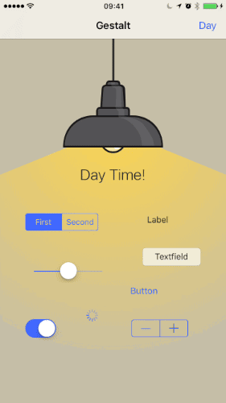

# Gestalt

**Gestalt** is an **unintrusive** and **light-weight** framework for **application theming** with support for **animated theme switching**.



## Usage

Let's say you want to theme a view controller with a single label:

```swift
import Gestalt

struct Theme: ThemeProtocol {
    let font = UIFont.preferredFont(forTextStyle: .headline)
    let color: UIColor
    let backgroundColor: UIColor

    static let light = Theme(
        color: UIColor.black
        backgroundColor: UIColor.white
    )

    static let dark = Theme(
        color: UIColor.white
        backgroundColor: UIColor.black
    )
}

// In `AppDelegate.application(_:didFinishLaunchingWithOptions:)`
// assign a default theme (or user's choice from user defaults):
ThemeManager.default.theme = Theme.light

class ViewController: UIViewController {
    @IBOutlet var label: UILabel!

    override func viewDidLoad() {
        super.viewDidLoad()

        ThemeManager.default.apply(theme: Theme.self, to: self) { themeable, theme in
            themeable.view.backgroundColor = theme.backgroundColor
            themeable.label.textColor = theme.color
            themeable.label.font = theme.font
        }
    }
}
```

A call to `ThemeManager.apply(theme:to:animated:closure:)` registers the closure passed to it on the given `ThemeManager` for future theme changes and then calls it once immediately. If you want the initial call to be animated, make sure to pass `…, animated: true, …` to it (the default is `false`).

To change the current theme (even while the app is running) simply assign a different theme to your given `ThemeManager` in use:

```swift
ThemeManager.default.theme = Theme.dark
```

This will cause all previously registered closures on the given `ThemeManager` to be called again.

#### Note:

1. It is generally sufficient to use `ThemeManager.default`. It is however possible to create dedicated `ThemeManager`s via `let manager = ThemeManager()`.
2. The value passed to `animated` overrides the `ThemeManager`'s default setting
of `var animated: Bool` for the initial call of the closure.

#### Important:

1. Within `closure` any access on `themeable` should only achieved through
 the closure's `$0` argument, not directly, to avoid retain cycles.
2. The body of `closure` should be [idempotent](https://en.wikipedia.org/wiki/Idempotence)
 to avoid unwanted side-effects on repeated calls.

## Installation

The recommended way to add **Gestalt** to your project is via [Carthage](https://github.com/Carthage/Carthage):

    github 'regexident/Gestalt'
    
or via [Cocoapods](https://cocoapods.org):

    pod 'Gestalt'

## License

**Gestalt** is available under the **MPL-2.0 license**. See the `LICENSE` file for more info.
